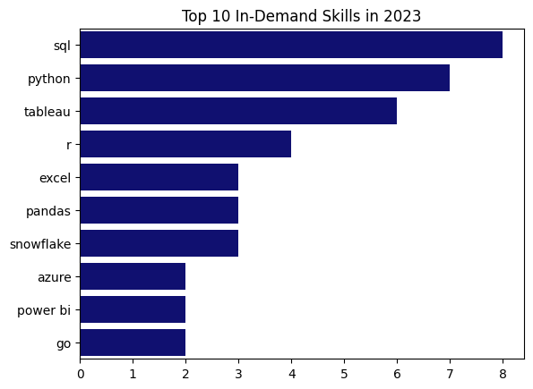

# Intro
To learn SQL basics, I followed the tutorial on YouTube from Luke Barousse (*Learn SQL in 4 Hours*).

- [source for tutorial](https://github.com/lukebarousse/SQL_Project_Data_Job_Analysis/tree/main)
- code and plots saved [here](/pqueries/)

# Data Analysis 
**The questions I wanted to answer through my SQL queries were:**

1. What are the top-paying companiesdata analyst jobs?

| Company                                           | Average Salary ($) |
|---------------------------------------------------|---------------------|
| Mantys                                            | 650,000.00          |
| Meta                                              | 336,500.00          |
| AT&T                                              | 255,829.50          |
| Pinterest Job Advertisements                     | 232,423.00          |
| Uclahealthcareers                                 | 217,000.00          |
| SmartAsset                                        | 195,500.00          |
| Inclusively                                       | 189,309.00          |
| Motional                                          | 189,000.00          |
| A-Line Staffing Solutions                         | 170,000.00          |
| Kelly Science, Engineering, Technology & Telecom  | 170,000.00          |

2. What skills are required for these top-paying jobs?
*Results for top skills* 

3. What skills are most in demand for data analysts?

| Skill Name | Total Mentions |
|------------|----------------|
| sql        | 7291           |
| excel      | 4611           |
| python     | 4330           |
| tableau    | 3745           |
| power bi   | 2609           |
| r          | 2142           |
| sas        | 933            |
| sas        | 933            |
| looker     | 868            |
| azure      | 821            |

4. Which skills are associated with higher salaries?

*Results for top 10 paying skills:*

| Skill           | Average Salary ($) |
|-----------------|--------------------|
| pyspark         | 208,172.3          |
| bitbucket       | 189,154.5          |
| couchbase       | 160,515.0          |
| watson          | 160,515.0          |
| datarobot       | 155,485.5          |
| gitlab          | 154,500.0          |
| swift           | 153,750.0          |
| jupyter         | 152,776.5          |
| pandas          | 151,821.3          |
| elasticsearch   | 145,000.0          |

5. What are the most optimal skills to learn?

| Skill       | Total Mentions | Average Salary ($) |
|-------------|----------------|---------------------|
| go          | 27             | 115,319.89          |
| confluence  | 11             | 114,209.91          |
| hadoop      | 22             | 113,192.57          |
| snowflake   | 37             | 112,947.97          |
| azure       | 34             | 111,225.10          |
| bigquery    | 13             | 109,653.85          |
| aws         | 32             | 108,317.30          |
| java        | 17             | 106,906.44          |
| ssis        | 12             | 106,683.33          |
| jira        | 20             | 104,917.90          |